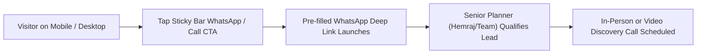
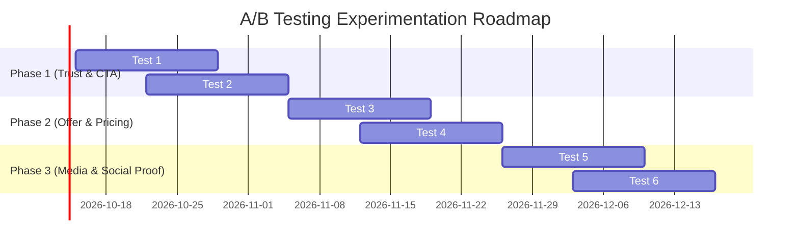

# Conversion Rate Optimization (CRO) Strategy & Conversion Architecture
**Client:** Weddings Vision (`weddingsvision.com`)  
**Positioning:** *"Rajasthani Heritage Meets Modern Design"*  
**Primary Conversion Goal (Macro):** Paid bookings for (1) Venue Consultation (`₹2,999`) and (2) Wedding Planning Blueprint (`₹4,999`) via Razorpay (UPI-first, INR).  
**Secondary Conversion Goal:** High-intent, qualified WhatsApp / Phone leads for Full Wedding Planning.

---

## 1. Conversion Model & Funnel Architecture

### 1.1 The Macro-Funnel: Paid Consultation Products
The paid consultation funnel is designed on progressive commitment, minimizing cognitive friction before presenting payment.

```mermaid
flowchart LR
    A["1. Visit / Landing"] --> B["2. Scroll to Offer / Segment"]
    B --> C["3. Start Booking (Modal Open)"]
    C --> D["4. Step 1: Qualification Scope"]
    D --> E["5. Step 2: Slot Selection"]
    E --> F["6. Step 3: Contact Details"]
    F --> G["7. Checkout Started (Razorpay)"]
    G --> H["8. Payment Confirmed (Macro Conversion)"]
    H --> I["9. Instant WhatsApp / Calendar Sync"]
```



#### Detailed Funnel Stages & Drop-Off Countermeasures
1. **Visit / Landing (`visit`):**
   - *Goal:* Hook user within 3 seconds; establish geographical authority (Jaipur, Rajasthan) and anti-template luxury.
   - *Drop-off Countermeasure:* Instant segment selector in hero allowing immediate self-routing.
2. **Scroll to Offer (`scroll_to_offer`):**
   - *Goal:* Engage visitor with distinct single-job offer cards (Venue Advisory vs. Planning Blueprint).
   - *Drop-off Countermeasure:* High-contrast pricing badge (`₹2,999` and `₹4,999`), clear deliverables bulleted with checkmarks, and the 100% fee credit guarantee.
3. **Start Booking (`start_booking`):**
   - *Trigger:* Clicking "Book Venue Advisory" or "Book Planning Blueprint" or sticky mobile bar.
   - *Experience:* Non-intrusive progressive modal sheet opening smoothly without page reload.
4. **Qualification Scope (`form_step_1`):**
   - *Inputs:* Target Season/Month, Estimated Guest Count, Preferred Rajasthan Region, Budget Bracket.
   - *Psychological Principle:* Micro-commitments. Selecting buttons/dropdowns feels like tailoring a solution, not filling out a form.
5. **Slot Selection (`form_step_2`):**
   - *Inputs:* Live date picker (within next 14 days) + 4 authentic time windows (including an NRI-friendly evening slot for US/UK/UAE time zones).
   - *Psychological Principle:* Specificity builds reality. Selecting a specific slot creates anticipation of attendance.
6. **Contact Details (`form_step_3`):**
   - *Inputs:* Full Name, WhatsApp Number (+91), Email Address, and optional Venue Notes.
   - *Drop-off Countermeasure:* Zero request for home address or postal code.
7. **Checkout Started (`checkout_started`):**
   - *Experience:* Razorpay checkout modal initialized with UPI (Google Pay, PhonePe, Paytm, QR code) as the default top choice, followed by Netbanking and Cards.
   - *Drop-off Countermeasure:* 256-Bit SSL trust badge + explicit "100% Credited to Full Planning" banner right above the payment button.
8. **Payment Confirmed (`payment_success` - Macro Conversion):**
   - *Experience:* Immediate confetti confirmation state, unique booking reference ID (`WV-XXXXXX`), summary of chosen slot, and direct 1-tap "Sync with Senior Planner on WhatsApp" CTA.

---

### 1.2 The Secondary Funnel: Qualified Full-Planning Leads
For couples planning a ₹50L - ₹3Cr+ wedding who prefer immediate human conversation over booking a structured self-serve session.



#### Pre-filled Intent Templates for WhatsApp
- **From Venue Section:**  
  `"Hi Weddings Vision, I am exploring palace wedding venues in Rajasthan for approx. [X] guests and would like to check availability."`
- **From General Sticky Bar:**  
  `"Hello Weddings Vision team, I am planning a wedding in Rajasthan and would like to consult with your planning team."`
- **From Footer / Contact Page:**  
  `"Hi Hemraj, I'd like to discuss full wedding planning services for an upcoming celebration in Jaipur."`

---

### 1.3 Micro-Conversions Taxonomy
Tracking these secondary interactions reveals intent bottlenecks before macro drop-offs:
1. `whatsapp_click`: Any tap on the floating, sticky bar, or inline WhatsApp CTAs.
2. `call_click`: Direct phone dial trigger (`tel:+919929252073`).
3. `segment_toggle`: Toggling between "Still deciding on venue" vs. "Venue booked, need planning".
4. `slot_picker_open`: Advancing past Step 1 into Step 2 of the booking modal.
5. `faq_toggle`: Expanding specific high-objection questions (sound curfews, NRI scheduling, fee models).
6. `social_proof_click`: Outbound click to verified WeddingWire reviews (10 reviews, 5.0 rating).
7. `venue_region_tab`: Clicking on Jaipur, Udaipur, Jodhpur, or Pushkar region cards.

---

## 2. Visitor Intent Segments & 5-Second Self-Selection Architecture

Indian destination wedding traffic falls into 3 distinct psychological segments. If the site fails to guide each segment within 5 seconds, mobile visitors bounce back to Instagram or Google.

```
+----------------------------------------------------------------------------------------------------+
|                                     VISITOR ENTERS HOMEPAGE                                        |
+----------------------------------------------------------------------------------------------------+
                                                  |
           +--------------------------------------+------------------------------------+
           |                                      |                                    |
           v                                      v                                    v
+----------------------+              +----------------------+             +----------------------+
|     SEGMENT A        |              |      SEGMENT B       |             |      SEGMENT C       |
| "I have no venue yet"|              |  "Venue booked, need |             |   "Just browsing /   |
|                      |              |       planning"      |             |  not ready to pay"   |
+----------------------+              +----------------------+             +----------------------+
           |                                      |                                    |
           v                                      v                                    v
+----------------------+              +----------------------+             +----------------------+
| PRIMARY DESTINATION: |              | PRIMARY DESTINATION: |             | PRIMARY DESTINATION: |
|  Venue Consultation  |              | Wedding Consultation |             | Qualified WhatsApp / |
|   (₹2,999 / 60 Min)  |              |  (₹4,999 / 90 Min)   |             |    Free Inquiry      |
+----------------------+              +----------------------+             +----------------------+
```

### 2.1 Segment Breakdown & Messaging Matrix

| Segment | Mental State & Primary Fear | Tailored Value Hook | 5-Second Self-Selection Trigger |
|---|---|---|---|
| **A: "I have no venue yet"** | Overwhelmed by Rajasthan palace options; terrified of hidden generator fees, 10 PM sound curfews, and locked vendor lists. | *"Unbiased palace & heritage intelligence. Save lakhs on hidden costs before paying venue advances."* | **Hero Tab/Button 1:**  <br/>`Book Venue Advisory (₹2,999)` |
| **B: "Venue booked, need planning"** | Has property contract; terrified of budget creep across 40 disparate vendors, uncoordinated halwais, and tacky decor. | *"Line-item budget modeling (200–800 pax), mandap creative direction, and 12-month milestone timeline."* | **Hero Tab/Button 2:**  <br/>`Book Planning Blueprint (₹4,999)` |
| **C: "Just browsing / not ready to pay"** | Early research phase (9–18 months out) or wants quick validation from a local planner before committing funds. | *"Speak directly with a local Jaipur planner. 100% transparent guidance, zero broker pressure."* | **Low-Friction Action:**  <br/>`WhatsApp Senior Planner (Free)` |

### 2.2 The 5-Second Hero Self-Selection UI Pattern
To ensure instantaneous comprehension on 360px mobile viewports:
1. **Eyebrow Tag:** `JAIPUR • RAJASTHAN WEDDING PLANNING` (instant local anchor).
2. **Asymmetrical Headline:** *Rajasthani heritage meets modern design.*
3. **Immediate Dual Action Cluster:**
   - **Primary Emerald Button:** `Book Venue Advisory (₹2,999)` with direct subtext: `100% Fee Credited to Full Planning`.
   - **Secondary White/Bordered Button:** `WhatsApp Senior Planner` (with green WhatsApp icon).
4. **Interactive Path Cards (Directly below hero fold):** Two distinct asymmetrical cards:
   - Left Card: *"Need a Palace or Heritage Venue?"* -> 60-min session scope, ₹2,999.
   - Right Card: *"Have a Venue, Need Concept & Budget?"* -> 90-min session scope, ₹4,999.

---

## 3. Offer Design & Risk Reversal (The Two Paid Products)

### Product 01: Rajasthan Palace & Heritage Venue Consultation

- **Target Persona:** Domestic and NRI couples wanting to celebrate in Jaipur, Udaipur, Jodhpur, or Pushkar who have not yet signed a property contract.
- **Core Problem Solved:** Property sales desks omit external vendor royalties (15-25%), mandatory 100% room buyout clauses, and 10 PM lawn sound cutoffs.
- **Duration & Format:** 60 Minutes • 1-on-1 Private Strategy Video Call (Google Meet / Zoom).
- **Executive Deliverables:**
  1. *Curated Property Shortlist:* 3 to 5 vetted heritage hotels, havelis, or palaces tailored to the exact guest tier (50 to 1,000+ pax) and budget bracket.
  2. *Hidden Cost Audit:* Line-by-line assessment of power generator (DG set) charges, sound curfew compliance, outside decorator royalty rates, and mandatory banquet minimums.
  3. *Excise & F&B Regulatory Roadmap:* Rajasthan liquor licensing rules, corkage guidelines, and royal halwai vs. hotel kitchen coordination rules.
  4. *Venue Negotiation Protocol:* Crucial contract clauses to enforce before remitting deposit advances.
  5. *Executive Post-Session PDF Summary:* Delivered via WhatsApp and email within 24 hours of call completion.
- **Pricing & What's Included:**
  - **Flat Fee:** `₹2,999` (All-inclusive; test/live mode via Razorpay UPI, Netbanking, Cards).
  - *Included:* 60-min strategy call + custom venue dossier + direct liaison POCs at shortlisted venues.
- **Risk Reversal & Flexibility Guarantee:**
  - **100% Fee Credit:** The entire ₹2,999 consultation fee is deducted from the final retainer if Weddings Vision is engaged for Full Wedding Planning within 45 days.
  - **Client Flexibility Toggles:** Free rescheduling up to 24 hours prior; session recording provided upon request.

---

### Product 02: Comprehensive Wedding Planning Blueprint

- **Target Persona:** Couples and families who have either finalized their venue or are evaluating their total commercial outlay across all wedding functions.
- **Core Problem Solved:** Destination wedding budgets frequently balloon by 35%–50% due to uncoordinated vendor contracts, duplicate logistics, and lack of line-item cost controls.
- **Duration & Format:** 90 Minutes • Deep Architectural Strategy Video Session (Google Meet / Zoom).
- **Executive Deliverables:**
  1. *Rajasthan Wedding Financial Model:* Itemized expense budget tailored to 200–800 guests, allocating precise percentage brackets for décor, catering, artist curation, sound/lighting production, hospitality, and photography.
  2. *Aesthetic Direction & Mandap Concept:* Cohesive visual moodboard marrying royal Rajasthani heritage (antique brass, block-print textiles, heritage stone motifs) with modern editorial minimalism.
  3. *12-Month Critical Path Timeline:* Sequenced checklist of vendor procurement deadlines, invitation milestones, bridal styling trials, and rehearsal schedules.
  4. *Vendor Selection Matrix:* Vetted directory of top photographers, cinematographers, makeup artists, mehendi stylists, and authentic Rajasthani folk/live artists (Manganiyar, Sufi, Kalbelia).
  5. *Comprehensive Post-Call Strategy Dossier:* Delivered within 36 hours.
- **Pricing & What's Included:**
  - **Flat Fee:** `₹4,999` (All-inclusive master strategy fee).
  - *Included:* 90-min strategy call + custom financial model spreadsheet + full aesthetic dossier.
- **Risk Reversal & Flexibility Guarantee:**
  - **100% Fee Credit:** The entire ₹4,999 fee is credited 100% toward our Full Wedding Planning contract if retained within 45 days.
  - **Satisfaction Pledge:** If the session does not reveal at least ₹50,000 in potential budget efficiencies or contract protections, the client may request an additional 30-minute follow-up session at zero charge.

---

## 4. Friction Audit of the Legacy Site (`weddingsvision.com`)

Based on our Phase 1 live browser extraction and DOM analysis of the current WordPress/Woodmart site:

| Diagnostic Parameter | Current Site Reality | Friction Impact on Conversion | Recommended Fix in Redesign |
|---|---|---|---|
| **Clicks to Inquire** | 4–6 clicks through generic navigation and footer anchors. | High bounce rate; users lose context while navigating through generic Elementor subpages. | **1-Click Modal Open:** Single tap on sticky thumb-zone bar or hero CTA launches progressive booking modal instantly. |
| **Form Fields Count** | 5 rigid fields in Contact Form 7: `Your Name`, `Phone Number`, `Email`, `Subject`, `Your Address` + Captcha. | **Extreme Friction:** Demanding a physical home address before even speaking to a planner causes over 60% abandonment. | **Zero Address Request:** Only request Name, WhatsApp Number, and Email at Step 3. |
| **Pricing Transparency** | Zero pricing mentioned anywhere across homepage or services pages. | Creates fear of astronomical costs or bait-and-switch broker pricing. High drop-off of quality NRI leads. | **Upfront Transparent Pricing:** Display ₹2,999 and ₹4,999 clearly with the 100% fee credit guarantee. |
| **Proof Adjacent to CTAs** | No reviews, ratings, or awards appear near the contact form or header buttons. | Absence of trust signals at the critical moment of conversion. | **Proof Sandwiching:** Verified WeddingWire 2024 Award and 5.0 Star rating badges positioned right beside all primary CTA buttons. |
| **WhatsApp Funnel** | Buried in an unconfigured Woodmart plugin (`joinchat-button`) with no pre-filled message context. | Mobile users land on blank chats and don't know what details to write. | **Contextual Deep Links:** One-tap pre-filled messages specifying the exact venue/wedding intent. |
| **Review Credibility** | Static Elementor shortcode widget that frequently fails to render real quotes. | Looks like unverified marketing claims. | **Direct Anchor to WeddingWire Profile:** Link directly to the 10 verified reviews with 5.0-star rating. |

---

## 5. Trust Plan: Proof Architecture Next to Every CTA

Under project rules, **only verified ground truth** is utilized. No fake client counts, fake countdowns, or simulated scarcity.

```
+-----------------------------------------------------------------------------------------------+
|                                      TRUST ANCHOR PLACEMENT                                   |
+-----------------------------------------------------------------------------------------------+
| 1. HERO CTA CLUSTER:                                                                          |
|    [Book Venue Advisory (₹2,999)]  [WhatsApp Senior Planner]                                  |
|    * Verified WeddingWire India Wedding Awards 2024 Winner                                    |
|    * 5.0 ★ Rated across 10 Verified Client Reviews                                           |
|    * 100% Fee Credited to Full Planning Engagement                                           |
|                                                                                               |
| 2. SERVICE 1 & 2 OFFER CARDS:                                                                 |
|    * 100% Fee Credit Guarantee Badge (Shield Icon)                                            |
|    * Independent Advisory Guarantee: "Zero Secret Venue Kickbacks. Direct Net Bills."        |
|    * Senior Planner Direct Access: Named planner Hemraj & Jaipur specialist team              |
|                                                                                               |
| 3. BOOKING MODAL (STEP 3 - PAYMENT):                                                          |
|    * Razorpay 256-Bit SSL Encrypted Trust Badge                                               |
|    * Accepted Payment Icons: UPI (GPay, PhonePe, Paytm), Netbanking, RuPay/Visa/Mastercard    |
|    * Instant Calendar Invite & Receipt Guarantee                                              |
|                                                                                               |
| 4. STICKY MOBILE ACTION BAR (360px):                                                          |
|    * Micro-Trust Snippet: "5.0 ★ • Razorpay Secured • 100% Fee Credit"                        |
+-----------------------------------------------------------------------------------------------+
```

### Verified Social Proof Assets in Repository:
- `public/assets/Wedding-Awards-2024-scaled.webp` (WeddingWire Annual Winner 2024)
- `public/assets/badge-rated-10.png` (WeddingWire 10 Reviews 5.0 Rating)
- Public Profile Reference: `https://www.weddingwire.in/wedding-planners/wedding-vision--e405719/reviews`
- Physical Address Coordinates: *6th Floor, Mahima Trinity Mall, Sodala, Jaipur 302019*

---

## 6. Measurement Plan & GA4 Event Taxonomy

### 6.1 Event Taxonomy (Google Analytics 4)

| Event Name | Trigger Condition | Parameters Tracked | Primary Business Significance |
|---|---|---|---|
| `cta_click` | Clicking any primary or secondary action button. | `cta_name`, `cta_location`, `service_type`, `viewport` | Top-of-funnel engagement rate |
| `path_selected` | Selecting Segment A ("Venue Advisory") or Segment B ("Wedding Planning"). | `path_name`, `selection_time_seconds` | Intent segmentation velocity |
| `booking_modal_open` | When the consultation booking modal becomes visible. | `initial_service`, `source_cta` | Funnel entry rate |
| `form_step_n` | User successfully advances between steps (1 -> 2, 2 -> 3). | `step_number`, `service_type`, `guest_bracket`, `region` | Funnel progression & drop-off pinpointing |
| `slot_selected` | User chooses a consultation date and time slot. | `slot_date`, `slot_time`, `service_type` | Scheduling intent commitment |
| `checkout_started` | Clicking "Pay ₹X via UPI / Card" to launch Razorpay gateway. | `service_type`, `amount_inr`, `currency: 'INR'` | Pre-payment conversion rate |
| `payment_success` | Razorpay payment successfully authorized and verified. | `order_id`, `payment_id`, `service_type`, `amount_inr` | **Primary Macro Conversion** |
| `payment_failed` | Payment declined, cancelled, or gateway error. | `order_id`, `error_code`, `service_type` | Technical payment drop-off |
| `whatsapp_click` | User taps any WhatsApp button or deep link. | `trigger_location`, `prefilled_context` | Secondary lead generation rate |
| `call_click` | User taps phone number link (`tel:`). | `trigger_location` | Immediate telephone inquiry rate |
| `faq_toggle` | User expands a question in the FAQ section. | `faq_question`, `open_state` | User hesitation & objection tracking |

---

### 6.2 Heatmap & Session Recording (Microsoft Clarity)
To observe real mobile thumb interactions and detect rage clicks on 360px screens:
- **Project Setup:** Install Microsoft Clarity tracking code in `index.html`.
- **Custom Tags:**
  - `clarity("set", "service_viewed", "venue" | "wedding")`
  - `clarity("set", "user_segment", "no_venue" | "venue_booked" | "browsing")`
  - `clarity("set", "modal_reached_step", "step_1" | "step_2" | "step_3" | "confirmed")`
- **Key Heatmap Screens to Monitor:**
  1. Sticky Mobile Action Bar click density vs. bounce rate.
  2. Dropdown tap friction on mobile Safari and Chrome (360px width).
  3. FAQ accordion engagement patterns.

---

### 6.3 A/B Testing Backlog (6 Structured Hypotheses)



#### Test 01: Hero Headline (Heritage Pride vs. Loss Aversion)
- **Hypothesis:** Positioning the headline around avoiding expensive Rajasthan palace mistakes will drive higher consultation urgency than pure aesthetic positioning.
- **Control (A):** *"Rajasthani heritage meets modern design."*
- **Variation (B):** *"Avoid the costly traps of booking a Rajasthan wedding palace."*
- **Primary Metric:** `start_booking` conversion rate.
- **Guardrail Metric:** Total time on page.

#### Test 02: Primary CTA Label (Advisory vs. Concrete Deliverable)
- **Hypothesis:** Framing the CTA around a tangible physical deliverable ("Get Palace Shortlist & Fee Audit") will increase clicks compared to abstract "Advisory".
- **Control (A):** `Book Venue Advisory (₹2,999)`
- **Variation (B):** `Get Palace Shortlist & Fee Audit (₹2,999)`
- **Primary Metric:** `cta_click` -> `start_booking`.
- **Guardrail Metric:** Step 3 payment completion rate.

#### Test 03: Price Display Architecture (Strikethrough Anchor vs. Flat Net Fee)
- **Hypothesis:** Anchoring the consultation against standard market value (₹6,000) will increase perceived value and checkout completions.
- **Control (A):** `₹2,999 (All-Inclusive)` with `100% Credited to Full Planning`.
- **Variation (B):** `Standard Fee ₹6,000 -> Today ₹2,999 (100% Credited to Full Planning)`.
- **Primary Metric:** `checkout_started` -> `payment_success`.
- **Guardrail Metric:** Refund / cancellation inquiries.

#### Test 04: Form Step Sequence (Scope First vs. Contact First)
- **Hypothesis:** Asking for the guest count and target season first creates sunk cost and ownership, resulting in higher Step 3 checkout completion than asking for email/phone first.
- **Control (A):** Step 1: Scope -> Step 2: Slot -> Step 3: Contact & Pay.
- **Variation (B):** Step 1: Contact (Name/Phone) -> Step 2: Scope -> Step 3: Slot & Pay.
- **Primary Metric:** Total completed paid bookings (`payment_success`).
- **Secondary Metric:** Abandoned phone leads captured for follow-up.

#### Test 05: Hero Media Asset (Architectural Wedding Stage vs. Live Planner in Action)
- **Hypothesis:** Featuring a recognizable planner photo with architectural drawing boards in Jaipur conveys greater tactical expertise than an empty floral stage.
- **Control (A):** Authentic royal mandap & lounge photo (`/assets/0V9A7363.webp`).
- **Variation (B):** Named senior planner (Hemraj & team) holding architectural site blueprints at a Jaipur palace.
- **Primary Metric:** Visitor scroll depth to Section 3 (Venue Advisory).
- **Guardrail Metric:** Bounce rate.

#### Test 06: Social Proof Proximity (Micro-Badges Below CTA vs. Testimonial Quote Above CTA)
- **Hypothesis:** Placing a verified quote directly above the button removes the final friction barrier faster than general star badges below.
- **Control (A):** Badges placed 16px below CTA buttons.
- **Variation (B):** Single verified 1-sentence quote (*"Hemraj saved us ₹3.5 Lakhs on palace generator clauses."* - WeddingWire Verified) placed 8px directly above CTA.
- **Primary Metric:** `start_booking` click-through rate on mobile.
- **Guardrail Metric:** Mobile thumb-zone misclicks.

---

## 7. Approval & Next Steps

This strategy document is committed in the project at [`/cro/strategy.md`](file:///d:/SOFTWARE%20DEVELOPMENT/WEDDING%20VISION/cro/strategy.md).

With the conversion architecture, intent segmentation, offer design, friction audit, trust plan, and GA4 measurement plan established, all layout and component implementations directly serve the primary outcome: **paid consultation bookings**.
