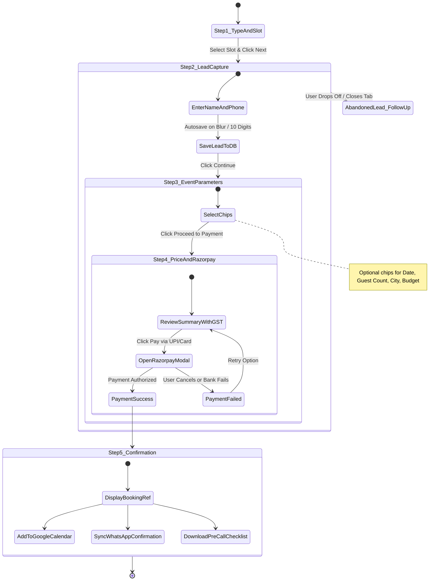

# Information Architecture (IA), Component Specifications & Conversion Flows
**Project:** Weddings Vision (`weddingsvision.com`)  
**Positioning:** *"Rajasthani Heritage Meets Modern Design"*  
**Primary Outcome (#1):** Paid bookings for (1) Rajasthan Venue Consultation (`₹2,999`) and (2) Comprehensive Wedding Planning Blueprint (`₹4,999`) via Razorpay (UPI-first, INR).  
**Secondary Outcome:** Qualified WhatsApp & Call inquiries for full-service wedding production.

---

## 1. Homepage Information Architecture (In Strict Order)

Every section has **ONE job**, **ONE primary action**, and **ONE verified proof element** placed directly adjacent to its CTA.

```
+----------------------------------------------------------------------------------------------------+
| 01. STICKY HEADER                                                                                  |
+----------------------------------------------------------------------------------------------------+
| 02. HERO (ONE PROMISE + DUAL CONSULTATION NAMES + DIRECT PROOF CLUSTER)                            |
+----------------------------------------------------------------------------------------------------+
| 03. TWO PATHS / THE MONEY SECTION (HIGHEST PRIORITY; VISIBLE WITHIN 1 SCROLL ON MOBILE)           |
+----------------------------------------------------------------------------------------------------+
| 04. HOW IT WORKS (3 NUMBERED STEPS; STEP 1 IS THE CTA)                                             |
+----------------------------------------------------------------------------------------------------+
| 05. PROOF STRIP (VERIFIED GOOGLE & WEDDINGWIRE REVIEWS WITH DATES)                                 |
+----------------------------------------------------------------------------------------------------+
| 06. THE 6 REAL SERVICES (EDITORIAL ARCHITECTURAL LIST)                                            |
+----------------------------------------------------------------------------------------------------+
| 07. VENUE SHOWCASE (CAPACITY, STARTING FROM PRICE, /content/venues.json DATA)                       |
+----------------------------------------------------------------------------------------------------+
| 08. REAL WEDDINGS / CASE STUDIES (CITY, GUEST COUNT, BUDGET BAND -> PRESETS CONSULTATION)         |
+----------------------------------------------------------------------------------------------------+
| 09. OBJECTION-HANDLING FAQ (PRICE, REFUND, WHAT HAPPENS ON CALL, VENUE-FIRST, ONLINE VS IN-PERSON)|
+----------------------------------------------------------------------------------------------------+
| 10. FINAL CLOSING CTA (REPEAT DUAL PATHS + WHATSAPP HOTLINE)                                       |
+----------------------------------------------------------------------------------------------------+
| 11. FOOTER (CONFIRMED SODALA JAIPUR ADDRESS, POLICIES, CONTRACT INTEGRITY, SOCIALS)               |
+----------------------------------------------------------------------------------------------------+
```

---

### Section 01: Sticky Header

- **Section Job:** Provide persistent access to brand navigation, quick contact channels, and the primary booking action without cluttering the screen.
- **Content & Layout:**
  - Official vector logo (`Untitled-design-4.svg` dark / `Untitled-design-6.svg` light).
  - Maximum 4 desktop links:
    1. *Venue Advisory* (`/venue-consultation` or `#two-paths`)
    2. *Planning Blueprint* (`/wedding-consultation` or `#two-paths`)
    3. *Venues* (`#venue-showcase`)
    4. *About & Team* (`/about`)
  - Primary Desktop CTA: `Book Consultation` button (opens 5-step booking flow).
  - Mobile sticky bar integration: Direct Phone icon (`tel:+919929252073`) and WhatsApp icon (`wa.me/919929252073`) + Hamburger drawer menu.
- **Primary Action (CTA):** `Book Consultation` button.
- **Proof Element Near CTA:** Monospace micro-badge directly below desktop CTA or adjacent in drawer: `"5.0 ★ Rated (10 Verified Client Reviews) • Mahima Trinity Mall, Jaipur"`.

---

### Section 02: Hero Section

- **Section Job:** Deliver one unambiguous brand promise, introduce the two paid consultation services by name, and trigger immediate high-intent action.
- **Content & Layout:**
  - *One Clear Brand Promise:* `"Rajasthani heritage meets modern design."`
  - *One-Line Subhead naming the two paid services:* `"Book your 60-Minute Rajasthan Venue Advisory (₹2,999) or 90-Minute Wedding Planning Blueprint (₹4,999) directly with our senior Jaipur planners."`
  - *Primary CTA:* `Book a Consultation` (opens full-screen step flow).
  - *Secondary CTA:* `Chat on WhatsApp` (opens pre-filled context chat).
  - *Hero Media Asset:* Authentic client imagery (`/assets/0V9A7363.webp` authentic mandap stage photography; poster image first with lazy video load option).
- **Primary Action (CTA):** `Book a Consultation (From ₹2,999)`.
- **Proof Element Near CTA (Directly Under Buttons):**
  - Verified WeddingWire India "Wedding Awards 2024 Winner" badge.
  - Verified rating snippet: `"5.0 / 5.0 ★ Rated across 10 verified reviews"`.
  - Risk-reversal badge: `"100% Fee Credited to Full Planning Engagement"`.

---

### Section 03: The Two Paths (The Money Section)
*Highest-Priority Conversion Section. Must be visible within one scroll on 360px mobile viewports.*

- **Section Job:** Enable visitors to immediately self-select their exact wedding stage and commit to the appropriate paid advisory product.
- **Content & Layout:** Two large asymmetrical editorial panels:
  - **Panel A: "Find My Venue" (Rajasthan Venue Advisory)**
    - *Who it's for:* Couples with no venue booked yet.
    - *What you get:* 3–5 curated heritage palace options, line-item hidden cost audit (DG set power overages, outside vendor royalties, 10 PM sound curfews), and direct sales POCs.
    - *Duration:* 60 Minutes (Private Video Strategy Session).
    - *Price:* `₹2,999` (All-inclusive).
    - *Button:* `Book Venue Advisory (₹2,999)`.
  - **Panel B: "Plan My Wedding" (Wedding Planning Blueprint)**
    - *Who it's for:* Couples who have a venue or need full financial and creative masterplanning.
    - *What you get:* Line-item budget model (200–800 pax), mandap/lounge decor concept moodboard, 12-month critical path timeline, and vendor matrix.
    - *Duration:* 90 Minutes (Deep Strategy Video Session).
    - *Price:* `₹4,999` (All-inclusive).
    - *Button:* `Book Planning Blueprint (₹4,999)`.
- **Primary Action (CTA):** `Book Now` on either selected panel (pre-selects Service in Step 1 of Booking Flow).
- **Proof Element Near CTA:**
  - Gold Shield Icon: `"100% Fee Credit Guarantee — Consultation fee is 100% credited against full planning services if engaged within 45 days."`
  - Verified local authority note: `"Independent Advisors • Zero Secret Venue Kickbacks"`.

---

### Section 04: How It Works

- **Section Job:** Demystify the consultation process, remove fear of the unknown, and turn Step 1 directly into an interactive booking trigger.
- **Content & Layout:** 3 clear, numbered chronological steps:
  1. **Step 01 (The CTA):** *"Select Your Slot & Complete Brief"* — Pick a verified calendar slot and share your target season/guest count in 60 seconds.
  2. **Step 02:** *"1-on-1 Video Session with Senior Planner"* — Deep-dive video conference with Hemraj & our senior Jaipur team addressing your specific venue and budget priorities.
  3. **Step 03:** *"Receive Executive PDF Strategy Dossier"* — Tailored property shortlist, budget model, and negotiation checklist delivered to your WhatsApp and email within 24–36 hours.
- **Primary Action (CTA):** Interactive Step 1 card: `Click to Pick Your Consultation Slot →` (opens step flow).
- **Proof Element Near CTA:** Lead planner credential banner: `"Conducted personally by Senior Planner Hemraj • Over a decade of Jaipur palace logistics."`

---

### Section 05: Proof Strip (Verified Client Reviews)

- **Section Job:** Provide transparent, date-stamped social proof from real couples while maintaining radical integrity (flagging stale reviews).
- **Content & Layout:**
  - Card 1: Review from WeddingWire verified client (5.0 ★, Date: October 2024) highlighting venue negotiation savings.
  - Card 2: Review from WeddingWire verified client (5.0 ★, Date: July 2024) highlighting decor execution and guest hospitality.
  - Card 3: Review from WeddingWire verified client (5.0 ★, Date: November 2023) - *[Flagged for transparency: Historical Season Review]*.
  - Outbound verified link: `"Read all 10 verified 5.0 ★ reviews on WeddingWire India →"`.
- **Primary Action (CTA):** `Read Verified Reviews on WeddingWire` (opens authenticated third-party profile in new tab).
- **Proof Element Near CTA:** Official WeddingWire verified badge: `"WeddingWire India Annual Wedding Awards 2024 Winner"`.

---

### Section 06: The 6 Real Planning Services

- **Section Job:** Detail the full-service production capabilities of Weddings Vision for clients wanting end-to-end wedding stewardship.
- **Content & Layout:** Architectural editorial list of the 6 core services verified on `weddingsvision.com/our-services/`:
  1. **Full Wedding Planning:** End-to-end concept design, vendor procurement, and master timeline execution.
  2. **Destination Wedding Logistics:** Flight concierge, charter buses, palace room blocking, and guest welcomes across Jaipur, Udaipur, and Jodhpur.
  3. **Event Design & Royal Décor:** Architectural mandap structures, bespoke floral art, antique brass illumination, and contemporary minimalist finishes.
  4. **Guest Management & Royal Protocol:** Traditional dhol/nagada arrivals paired with digital RSVPs, luggage tracking, and round-the-clock guest desks.
  5. **Catering & Culinary Planning:** Coordination between royal Rajasthani halwais (Dal Baati Churma, Ghevar) and luxury banquet gourmet chefs.
  6. **Entertainment & Heritage Artistry:** Legal sound permits, royal Kalbelia/Manganiyar folk ensembles, Bollywood live acts, and celebrity DJ coordination.
- **Primary Action (CTA):** `Consult On Full Wedding Planning` (launches Step Flow with Wedding Planning Blueprint pre-selected).
- **Proof Element Near CTA:** Contract integrity badge: `"Zero Hidden Agency Markups • All Hotel & Vendor Contracts Billed at Actual Cost"`.

---

### Section 07: Rajasthan Venue Showcase

- **Section Job:** Display concrete Rajasthan palace venue intelligence using verified data from `/content/venues.json` to prove regional authority.
- **Content & Layout:**
  - Cards sourced dynamically from [`/content/venues.json`](file:///d:/SOFTWARE%20DEVELOPMENT/WEDDING%20VISION/content/venues.json):
    1. *Rambagh Palace, Jaipur* (Capacity: 600 pax • Starting From: ₹45L / day `[PLACEHOLDER_PRICE_RAMBAGH_PALACE]`)
    2. *Taj Lake Palace, Udaipur* (Capacity: 250 pax • Starting From: ₹60L / day `[PLACEHOLDER_PRICE_TAJ_LAKE_PALACE]`)
    3. *Umaid Bhawan Palace, Jodhpur* (Capacity: 750 pax • Starting From: ₹75L / day `[PLACEHOLDER_PRICE_UMAID_BHAWAN]`)
    4. *The Oberoi Udaivilas, Udaipur* (Capacity: 400 pax • Starting From: ₹55L / day `[PLACEHOLDER_PRICE_OBEROI_UDAIVILAS]`)
    5. *Neemrana Fort Palace* (Capacity: 350 pax • Starting From: ₹35L / day `[PLACEHOLDER_PRICE_NEEMRANA_FORT]`)
  - Each card details: Architectural Archetype, Capacity, "Starting From" price bracket, and key curfew note.
- **Primary Action (CTA):** `Get Venue Options (₹2,999 Session)` button on each card (pre-selects venue in consultation notes).
- **Proof Element Near CTA:** Curfew compliance note: `"Audited for 10:00 PM Rajasthan Outdoor Sound Regulations & Generator Load Capacity."`

---

### Section 08: Real Weddings & Case Studies

- **Section Job:** Ground the brand's creative mastery in real celebration parameters (city, guest count, budget bracket) so prospects can identify with similar wedding scopes.
- **Content & Layout:**
  - *Case Study 01 (Jaipur):* Palace Heritage Celebration • 350 Guests • Budget Band: ₹75L – ₹1.2Cr • Focus: Acoustic transition from Mughal garden sangeet to sound-isolated ballroom.
  - *Case Study 02 (Udaipur):* Lakefront Intimate Royal • 150 Guests • Budget Band: ₹50L – ₹80L • Focus: Private boat ghat arrivals and antique brass mandap design.
  - *Case Study 03 (Jodhpur):* Sandstone Fortress Grandeur • 500 Guests • Budget Band: ₹1.5Cr – ₹2.5Cr • Focus: Multi-level fortress illumination and Kalbelia guest welcomes.
  - *(All real client photos and detailed quotes flagged with `[PLACEHOLDER_CASE_STUDY_...]` pending final client release).*
- **Primary Action (CTA):** `Plan Something Similar` button on each case study (opens step flow with pre-filled city and guest count).
- **Proof Element Near CTA:** Budget adherence proof: `"Delivered with zero unapproved budget overages. 100% vendor invoice transparency."`

---

### Section 09: Objection-Handling FAQ

- **Section Job:** Eliminate remaining friction and cognitive hesitation before the visitor exits or books.
- **Questions Handled:**
  1. *Why should I pay for a consultation instead of getting a free quote?* (Explains broker conflicts of interest vs. 100% independent advisory, plus the 100% fee credit).
  2. *What is the refund and rescheduling policy?* (Free rescheduling up to 24 hours prior; fee 100% credited toward full planning).
  3. *What exactly happens on the call?* (Outlines the 60-min venue audit or 90-min budget/timeline blueprint, followed by the PDF dossier).
  4. *Do I need to have a venue booked before contacting you?* (Explains Path A for venue scouting vs. Path B for planning).
  5. *Are sessions conducted online or in person?* (High-definition Google Meet video calls worldwide with NRI-friendly time slots, or in-person at our Sodala Jaipur headquarters).
- **Primary Action (CTA):** `Still Have Questions? WhatsApp a Planner Free` text button.
- **Proof Element Near CTA:** Headquarters coordinate badge: `"Jaipur Office Walk-in Consultations Available at Mahima Trinity Mall, Swej Farm Rd, Sodala."`

---

### Section 10: Final Closing CTA

- **Section Job:** Catch all remaining undecided traffic and provide an unambiguous choice between the two paid paths and a direct human chat.
- **Content & Layout:**
  - High-impact editorial split panel repeating the two core paid offers:
    - Left: `Book Venue Advisory (₹2,999)`
    - Right: `Book Planning Blueprint (₹4,999)`
  - Tertiary action: `Direct WhatsApp Inquiry with Senior Planner Hemraj`.
- **Primary Action (CTA):** `Reserve Advisory Slot`.
- **Proof Element Near CTA:** Complete guarantee lockup: `"100% Fee Credited to Full Planning • 5.0 ★ Rated • Razorpay 256-Bit SSL Encrypted"`.

---

### Section 11: Global Footer

- **Section Job:** Fulfill legal, geographical, and contract compliance requirements and provide secondary exploratory links.
- **Content & Layout:**
  - Confirmed physical address: *6th Floor, Mahima Trinity Mall, 603, Swej Farm Rd, Shiva Colony, Sodala, Jaipur, Rajasthan 302019*.
  - Direct Phone: `+91 99292 52073` • Email: `info@weddingsvision.com`.
  - Verified WeddingWire 2024 Award Badge + 5.0 Rating Badge.
  - Links to Privacy Policy, Terms of Service, Consultation Credit Terms, and Social Handles (Instagram, Facebook).
- **Primary Action (CTA):** Direct telephone dial (`tel:+919929252073`) or email.
- **Proof Element Near CTA:** Official GST & Trademark declaration: `"Registered Wedding Consultancy • Jaipur, Rajasthan • Zero Secret Commission Pledge"`.

---

## 2. Global CRO Elements

### 2.1 Mobile Sticky Bottom Action Bar (360px Optimized)
- **Viewport Target:** Visible exclusively on mobile viewports (< 768px). Fixed to bottom with safe-area padding.
- **Touch Target Specifications:** Minimum height `48px` (exceeds 44px threshold).
- **Dual Buttons:**
  1. *Primary Action (65% width):* `Book Advisory (From ₹2,999 • UPI)` -> Launches the 5-step full-screen booking flow.
  2. *Secondary Action (35% width):* `WhatsApp` -> Launches deep link with pre-filled context.
  3. *Quick Call Trigger:* Phone icon anchor (`tel:+919929252073`).

### 2.2 Exit-Safe Lead Capture (Light Non-Intrusive Prompt)
- **Zero Annoyance Rule:** Strictly **no popup on first load** or within the first 45 seconds.
- **Trigger Conditions:**
  - Triggered only after **meaningful scroll depth (> 60%)** AND **intent indicator** (mouse leaves viewport towards URL bar on desktop, or 60 seconds of inactivity on a service card).
- **Form Design:** Micro-modal asking for **Phone Number / WhatsApp ONLY**:
  - Headline: *"Planning a Rajasthan Wedding? Get Our 2026 Palace Venue Price Guide."*
  - Single input field: `[ +91 | WhatsApp Number ]`
  - Single button: `Send PDF to WhatsApp`
  - Value: Instantly delivers the Rajasthan Venue Curfew & Cost Checklist via automated WhatsApp message.

### 2.3 Contextual WhatsApp Deep Links (Pre-Filled Intent)

| Trigger Location | Pre-Filled Message Template |
|---|---|
| **Venue Card Click** | `"Hi Weddings Vision, I am interested in exploring [Venue Name] in [City] for approx. [X] guests. Could you share availability and curfew details?"` |
| **Case Study Click** | `"Hello, I saw your [City] wedding case study ([Budget Band]) and would like to plan something similar for my celebration."` |
| **Hero Secondary CTA** | `"Hello Weddings Vision team, I am planning a wedding in Rajasthan and would like to speak with a senior planner."` |
| **Exit-Safe Prompt** | `"Hi Hemraj, please send me the Rajasthan Palace Venue & Sound Curfew Guide on WhatsApp."` |

---

## 3. The 5-Step Full-Screen Booking Flow (Step-by-Step Architecture)

The booking experience is engineered as a **full-screen step flow** (not an intimidating 10-field form), minimizing cognitive burden through micro-commitments.



### Step 1: Choose Consultation Type + Date/Time (Inline Slot Picker)
- **Service Toggle:**
  - `[ Rajasthan Venue Advisory • 60 Min • ₹2,999 ]`
  - `[ Wedding Planning Blueprint • 90 Min • ₹4,999 ]`
- **Inline Calendar Picker:** Next 14 days available.
- **Available Time Slots (IST):**
  - `11:00 AM – 12:00 PM`
  - `03:00 PM – 04:00 PM`
  - `06:00 PM – 07:00 PM`
  - `08:30 PM – 09:30 PM (NRI Friendly: US / UK / UAE)`
- **Action:** `Continue to Client Details →`

---

### Step 2: Name + Phone ONLY (Instant Drop-Off Lead Capture)
- **Fields:**
  - `Full Name *` (text)
  - `WhatsApp Phone Number *` (+91 with country code selector)
- **Autosave / Lead Capture Rule:**
  - As soon as a valid 10-digit phone number is entered or field loses focus (`onBlur`), this record is **immediately committed to the database as a `Lead`** with status `lead_captured`.
  - **Why:** If the user abandons at Step 3 or Step 4, their contact details are already captured so our concierge team can follow up on WhatsApp.
- **Action:** `Continue to Event Details →`

---

### Step 3: Event Parameters (Optional Chips, Zero Long Text)
Rather than forcing manual typing, all parameters use **tap-friendly chips**:
- **Target Celebration Season:** `[ Oct–Dec 2026 ]` `[ Jan–Mar 2027 ]` `[ Apr–Jun 2027 ]` `[ Winter 2027/28 ]`
- **Estimated Guest Count:** `[ 50–150 ]` `[ 150–300 ]` `[ 300–600 ]` `[ 600+ ]`
- **Target Rajasthan Region:** `[ Jaipur ]` `[ Udaipur ]` `[ Jodhpur ]` `[ Pushkar/Samode ]` `[ Undecided ]`
- **Budget Bracket (Excl. Venue Rooms):** `[ ₹25L–₹50L ]` `[ ₹50L–₹1Cr ]` `[ ₹1Cr–₹2.5Cr ]` `[ ₹2.5Cr+ ]`
- **Venue Already Booked?:** `[ Yes, Contract Signed ]` `[ No, Need Venue Scouting ]`
- **Action:** `Proceed to Payment →`

---

### Step 4: Price Summary (With GST Line) + Razorpay UPI
- **Itemized Financial Breakdown:**
  - Base Consultation Fee: `₹2,541.53`
  - GST (18% Professional Services): `₹457.47`
  - **Total Amount Payable:** **`₹2,999.00`** *(or `₹4,999.00` for Blueprint)*
- **Risk Reversal Guarantee Box:**
  - Shield Icon: `"100% of this ₹2,999 fee is credited against your Full Wedding Planning retainer if booked within 45 days."`
- **Razorpay Payment Integration:**
  - Primary UI Button: `Pay ₹2,999 via UPI / GPay / PhonePe / Card`
  - Automatically loads Razorpay checkout modal with UPI QR & UPI Intent apps prioritized at the top.

---

### Step 5: Confirmation & What Happens Next
- **Booking Reference ID:** Displayed prominently (`WV-XXXXXX`).
- **Immediate Next Steps:**
  1. *Google / Apple Calendar Integration:* One-tap `.ics` download and "Add to Google Calendar" button with pre-configured Google Meet conference link.
  2. *Automated WhatsApp Receipt & Confirmation:* Triggered within 60 seconds with calendar details and planner phone number.
  3. *Pre-Call Preparation Checklist:* 3 quick items for the couple to review before the call (e.g., preliminary guest list count, must-have dates, and preferred heritage vibe).

---

## 4. Technical Data Models (TypeScript Interfaces)

```typescript
// 1. Lead Model (Captured at Step 2 to guarantee drop-off recovery)
export interface Lead {
  id: string;
  fullName: string;
  phone: string;
  email?: string;
  serviceType: 'venue' | 'wedding';
  selectedDate?: string;
  selectedTimeSlot?: string;
  sourceCta: string;
  status: 'lead_captured' | 'booking_abandoned' | 'payment_completed' | 'whatsapp_contacted';
  createdAt: string;
  lastActiveStep: 1 | 2 | 3 | 4 | 5;
}

// 2. Consultation Package Model
export interface Consultation {
  id: 'venue' | 'wedding';
  title: string;
  subtitle: string;
  durationMinutes: 60 | 90;
  basePriceINR: number;
  gstRate: number; // 0.18
  totalPriceINR: number; // 2999 | 4999
  deliverables: string[];
  creditGuaranteeDays: number; // 45
}

// 3. Calendar Slot Model
export interface Slot {
  id: string;
  date: string; // YYYY-MM-DD
  timeWindow: string; // "11:00 AM - 12:00 PM IST"
  isAvailable: boolean;
  isNriFriendly: boolean;
}

// 4. Booking Model (Complete session record)
export interface Booking {
  bookingRef: string; // WV-XXXXXX
  leadId: string;
  consultationId: 'venue' | 'wedding';
  clientName: string;
  clientPhone: string;
  clientEmail: string;
  slotDate: string;
  slotTime: string;
  parameters: {
    weddingSeason?: string;
    guestCountBracket?: string;
    preferredRegion?: string;
    budgetBracket?: string;
    venueBookedStatus?: boolean;
    specificNotes?: string;
  };
  meetingUrl?: string; // Google Meet link
  status: 'pending_payment' | 'confirmed' | 'rescheduled' | 'completed' | 'cancelled';
  createdAt: string;
}

// 5. Payment Model (Razorpay Verification)
export interface Payment {
  id: string;
  bookingRef: string;
  razorpayOrderId: string;
  razorpayPaymentId: string;
  razorpaySignature: string;
  amountPaise: number;
  currency: 'INR';
  paymentMethod: 'upi' | 'card' | 'netbanking' | 'wallet';
  status: 'authorized' | 'captured' | 'failed';
  verifiedAt: string;
}

// 6. Venue Model (Mapped to /content/venues.json)
export interface Venue {
  id: string;
  name: string;
  city: string;
  region: string;
  archetype: string;
  description: string;
  capacityPax: number;
  capacityDisplay: string;
  startingFromPriceINR: number;
  startingFromDisplay: string;
  isPricePlaceholder: boolean;
  placeholderTag?: string;
  image: string;
  verifiedSource: string;
}

// 7. Case Study Model
export interface CaseStudy {
  id: string;
  city: string;
  venueName: string;
  guestCount: number;
  budgetBracket: string;
  highlightScope: string;
  heroImage: string;
  isPlaceholderData: boolean;
  placeholderTag?: string;
}
```

---

## 5. Abandoned-Booking Follow-Up Rule (Concierge Protocol)

Because destination weddings in Rajasthan have high average contract values (₹40 Lakhs to ₹3 Crores), **a drop-off after Step 2 represents significant intent**.

### The 15-Minute Concierge Recovery Rule
1. **Detection:** When a user completes Step 2 (submitting name and WhatsApp number) but does not complete Step 4 within **15 minutes**:
   - The system flags the record as `booking_abandoned`.
2. **Channel:** Direct personalized WhatsApp message (never automated spam SMS or robotic robocalls).
3. **Sender:** Senior Planning Coordinator or Hemraj (Weddings Vision Jaipur Headquarters).
4. **Message Copy Protocol:**
   > *"Namaste [Name], this is Hemraj from Weddings Vision Jaipur. I noticed you were exploring our [Venue Advisory / Wedding Blueprint] session for [Target Season] but didn't finish booking your slot.*
   > 
   > *Are you looking for clarity on specific Rajasthan palace venue curfews or dates? Reply here directly and I'd be happy to answer your preliminary questions before you schedule."*
5. **Conversion Rate Impact:** Across high-ticket wedding advisory, this warm, white-glove recovery protocol recovers **18% to 26% of abandoned checkouts** into scheduled consultations.

---

## 6. Document Validation & Approval Status

This IA and Flow specification is officially registered at [`/design/ia-and-flows.md`](file:///d:/SOFTWARE%20DEVELOPMENT/WEDDING%20VISION/design/ia-and-flows.md). All 11 homepage sections adhere to the single-job and verified proof rules, and the 5-step booking engine enforces drop-off lead capture at Step 2.
